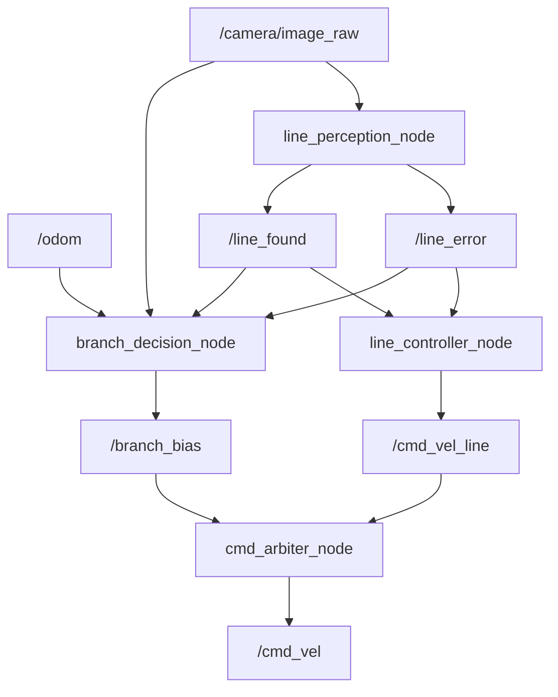

# Architecture Notes

The line-following system is split into four ROS 2 nodes.



## Main design rule

Only `cmd_arbiter_node` publishes to `/cmd_vel`.

The branch node does not directly drive the robot. It only publishes a small angular bias on `/branch_bias`.

This keeps the normal line follower in control while allowing branch handling to assist when appropriate.

## Topic flow

- `/camera/image_raw` feeds image processing.
- `/line_error` gives the pixel offset of the detected line.
- `/line_found` says whether the line was detected.
- `/cmd_vel_line` is the base line-following command.
- `/branch_bias` is a small angular steering assist.
- `/cmd_vel` is the final command sent to the robot.

## Control layout

The base control loop is:

```text
camera image -> line perception -> line error -> line controller -> base Twist
```

The branch-assist loop is:

```text
camera image + odometry + line state -> branch decision -> angular bias
```

The arbiter combines:

```text
base Twist + branch angular bias -> final /cmd_vel
```
